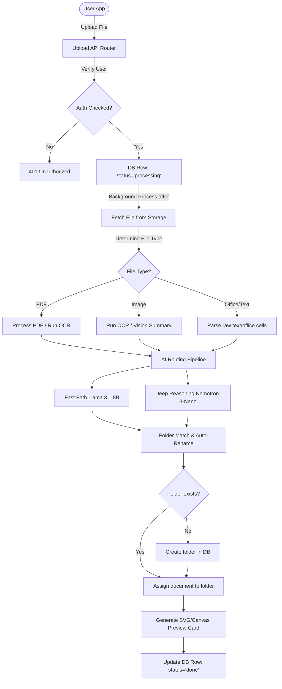

# 📄 PaperWait

<div align="center">

[](LICENSE)
[](https://nextjs.org/)
[](https://www.typescriptlang.org/)
[](https://supabase.com/)
[](https://build.nvidia.com/)

**"Because waiting to find it isn't an option."**

*A premium, secure, and AI-powered document intelligence safe that automates file organization.*

[Key Features](#-key-features) • [System Architecture](#-system-architecture) • [Getting Started](#-getting-started) • [Database Setup](#-database--storage-setup) • [Security Spec](#-security-specifications)

</div>

---

## 🌟 Key Features

- ⚡ **Multi-Format Processing**: Seamlessly ingests PDFs, images (PNG, JPEG), Word docs (`.docx`/`.doc`), Excel spreadsheets (`.xlsx`), PowerPoint slides (`.pptx`/`.ppt`), CSV, and TXT files.
- 🤖 **Ensembled Multi-Model AI Routing**:
  - **Llama 3.1 8B**: Evaluates fast-path document classification.
  - **Nemotron-3-Nano Reasoning**: Solves deep categorization and entity extraction.
  - **DeepSeek V4 Flash**: Creates friendly 1-sentence descriptions and summaries.
  - **Llama 3.2 11B Vision**: Describes visual-only and photo uploads.
- 📁 **Smart Folder Match & Auto-Creation**: Merges document context with user folder structures. Automatically routes transactional files (receipts, utility bills) and matches existing folders through substring and Levenshtein distance metrics.
- 🖼️ **On-Demand Visual Previews**: Automatically extracts the first page of PDFs, resizes images, and generates SVG/Canvas-based document cards for text and office files.
- 🔒 **Enterprise-Grade Security**: Strictly enforced Row Level Security (RLS) on both Postgres tables and Supabase Storage buckets ensures zero cross-tenant data leaks.

---

## 🏗️ System Architecture

The workflow below illustrates how files move securely from the upload boundary to AI-powered classification, visual preview generation, and directory routing.



---

## ⚙️ Environment Configuration

To run PaperWait locally, copy `.env.local.example` to `.env.local` and configure the following variables:

| Environment Variable | Description |
| :--- | :--- |
| `NEXT_PUBLIC_SUPABASE_URL` | The public API URL of your Supabase project instance |
| `NEXT_PUBLIC_SUPABASE_ANON_KEY` | The client-side Anonymous public key for Supabase API requests |
| `SUPABASE_SERVICE_ROLE_KEY` | The secret service role key (Required for secure background processing) |
| `NVIDIA_API_KEY_OCR` | Your NVIDIA API credential for the Nemotron OCR NIM |
| `NVIDIA_API_KEY_LLM` | Your NVIDIA API credential for Llama/Nemotron/DeepSeek models |
| `GOTENBERG_URL` | Gotenberg document conversion service URL (Optional, defaults to local dev server) |

---

## 🗄️ Database & Storage Setup

All database migrations are located in the `supabase/migrations/` directory.

### 1. Database Schema
Execute the migration scripts against your Supabase Postgres database. The schema configures:
- `public.folders`: Maps folders to specific user sessions.
- `public.documents`: Stores document statuses, OCR transcripts, descriptions, folder relationships, and JSON-serialized AI analysis details.

### 2. Row Level Security (RLS)
The migration enforces security boundaries using `auth.uid() = user_id`. No client can read, insert, update, or delete folders or documents unless they own them.

### 3. Supabase Storage Policies
Create a private bucket named `documents` in Supabase Storage. The storage policies enforce folder boundaries by parsing the storage path using the user's UUID:
```sql
CREATE POLICY "Allow users to read their own folder"
  ON storage.objects FOR SELECT
  USING ( bucket_id = 'documents' AND (auth.uid()::text = (storage.foldername(name))[1]) );
```
This ensures a user authenticated under UUID `X` can only read or write to paths matching `X/...` inside the bucket (e.g. `X/previews/doc-id.png` or `X/doc-id.pdf`).

---

## 🚀 Running the Application

### Installation
Install project dependencies:
```bash
npm install
```

### Run Development Server
```bash
npm run dev
```
Open [http://localhost:3000](http://localhost:3000) in your browser.

### Linting & Formatting
Verify your code syntax and TypeScript definitions:
```bash
npm run lint
```

### Production Build
Compile the application:
```bash
npm run build
```
Builds are optimized for production deployments (e.g., Vercel, Docker).

---

## 🛡️ Security Specifications

PaperWait has been engineered with safety at its core:
1. **API Keys Isolation**: No sensitive keys are hardcoded in the codebase. All keys are read from environment variables.
2. **Access Control**: Checked user IDs on all queries. Direct endpoints like file updates enforce strict ownership checks before committing database operations.
3. **Environment Security**: The `.gitignore` excludes credential files (`.env.local`) and development directories (`scratch/`) to ensure no operational credentials or local artifacts are ever staged.

---

## 📄 License

This repository is licensed under the [MIT License](LICENSE).
